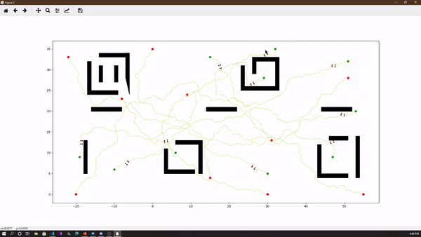

# Demo

This a simple project for path planning using  RRT (rapidly exploring random tree) with goal bias. 
# What do you need?

The code is written in python 3.8
You must install the following packages ( I am too lazy to put it in requirements.txt)

- numpy `pip install numpy`
- sharpely `pip install sharpely`
- networkx `pip install networkx`
- matplotlib `pip install matplotlib`
- scipy `pip install scipy`
- pandas `pip install pandas`

# How to run this code

The obstacles are set in the src/obstacles.csv.

The goal and start point are set in the src/constraints.csv. There are 10 total robots preset in the file. you can delete or add new one. the 3rd variable is the velocity of the robot. They can be any value, however, the plotting will not show the difference of velocity.

To run this code just run the python script `project.py`
you will be asked to choose the phase to run 1,2 or 3
you will be asked if you would like to plot the tree interactively.

The output of the path of each robot is saved into the folder paths as csv files
